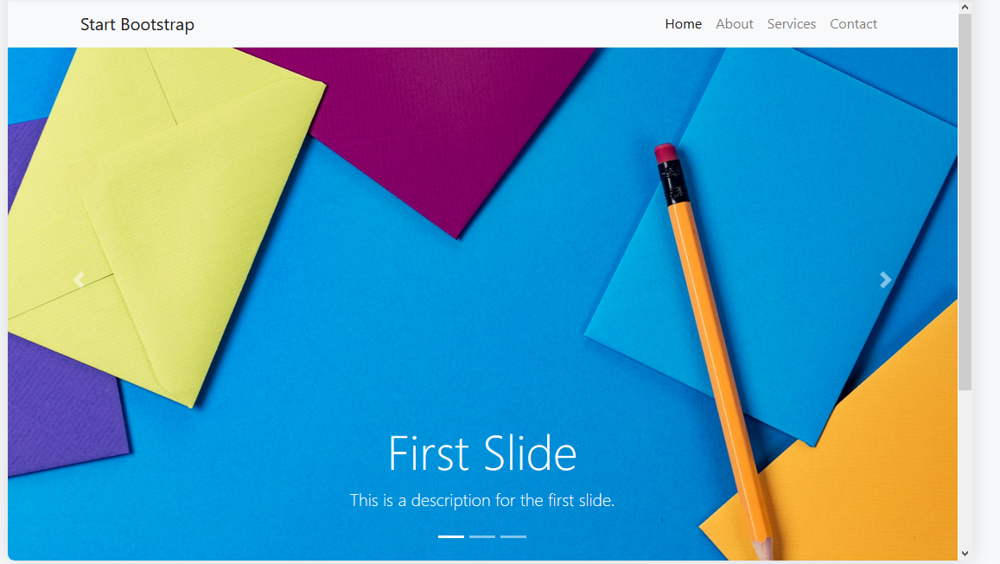
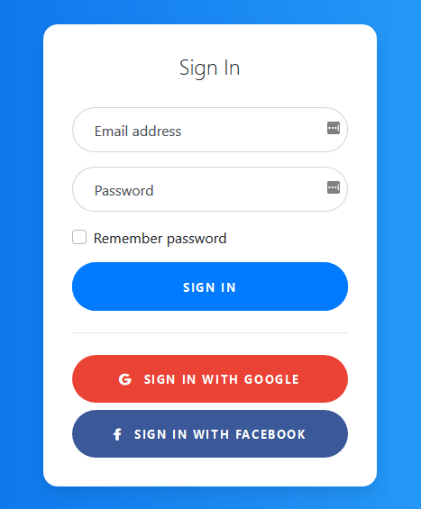

# Iniciando com Bootstrap

Frameworks são as maravilhas do mundo de dev e nos auxiliam em diversas atividades do dia a dia. Um dos framweorks mais conhecidos para css é o [Bootstrap](https://getbootstrap.com/), originalmente desenvolvido pela equipe do Twitter é mantido até os dias atuais por uma equipe dedicada. Vamos aprender como criar um template se baseando nos conteudos da w3school?

* Acesse esse [link para a w3schools](https://www.w3schools.com/bootstrap/), sendo direcionado para seção de bootstrap, nessa guia existe uma introdução do que é o bootstrap,  além de sua história. recomendamos que leiam tudo.

* Conforme continuam a leitura na seção bootstrap, ao final existirá uma guia onde você poderá testar a funcionalidade por si só. Se não conseguir chegar no link, te ajudamos, basta [clicar aqui](https://www.w3schools.com/bootstrap/tryit.asp?filename=trybs_gs_container-fluid&stacked=h).

* Nessa guia, ele ira te mostrar o código que vamos utilizar.

Observe que existe algumas ações disponíveis: você pode colocar em dark mode essa tela. existe um botão de `run`, quando você clica nele, existe um compilador por baixo dos panos que vai renderizar suas mudanças, então faça um teste, mudando textos dentro da propria pagina do w3schools e clique em `run`.

* Feito isto, apos de navegarmos bem no site, entendemos como funciona o w3schools mais pofudamente, sendo que vamos utiliza-lo muito. Vamos nos basear esse codigo para nossa atividade.

* Primeiro vamos gerar um repositorio novo no github, se ainda esta meio perdido nessa parte, sem problemas, [clique aqui](./github.md) que fizemos um guia bem legal ;). 

* Após gerar nosso repositório e clonar para uma nova pasta na nossa maquina, vamos criar um arquivo chamado index.html e escrever o código se baseando no apresentado pela `w3schools`. Não vamos simplesmente copiar e colar, porque isso não fara fixarmos o conteúdo, vamos escrever linha por linha.

A cada duvida que surgir conforme escrevemos, vamos pesquisar no google para entender o que esta acontecendo, por exemplo, vamos entender o que é `<!DOCTYPE html>`, o que essa linha significa, feito isso, vamos para próxima. 

Mesma coisa, vamos entender o que é o `<html lang="en">`, e como alterar para nosso idioma.

Vamos estudando linha por linha do código até não termos duvida do que o ele está fazendo.

No final, teremos algo assim:

Agora só commitar seu código e contar pra gente ;)

# Reaproveitando Snippets de Código

Aqui gostaríamos de sugerir alguns snippets (trechos) de código que adicionarão muitas funcionalidades na sua página da Web. Todos os exemplos são baseados no site [Startbootstrap.com](https://startbootstrap.com/snippets/)

### Slider grande

[Esse código](https://startbootstrap.com/snippets/full-slider/) nos permite adicionar um grande slider com várias imagens em nossa página. O resultado deve ficar assim:

Substitua as imagens e textos por suas próprias imagens e textos que fazem sentido para o seu site.

### Página de Login

[Esse código](https://startbootstrap.com/snippets/login/) nos dá uma bela tela de login para aplicar em nosso site. Tem uma área reservada só para assinates? Vai fazer integração de login com Google e com Facebook? É só colocar esse código lá.

# Indo além

Você na verdade pode construir qualquer coisa que quiser no seu frontend com o Bootstrap. O objetivo é se alavancar em todos os componentes que a equipe de desenvolvimento já criou, e você pode ter uma noção da extensa lista [aqui](https://getbootstrap.com/docs/4.5/components/alerts/).

Achou algo faltando aqui? Abre um PR e ajude a manter essa documentação viva :)

